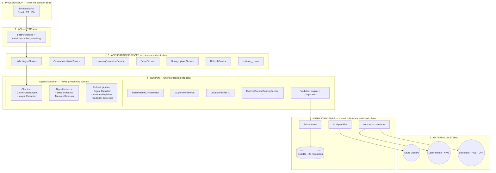

# 01 — System Overview

StormReady V3 is a weather-aware dinner forecasting system for independent
restaurants. It predicts cover counts per service night, explains the drivers
in plain language, and learns from operator feedback over time.

It is a monolith at runtime — one Python process, one React SPA bundle, one
embedded DuckDB file — with seven agent roles coordinating the intelligent
work inside the backend.

## Agent roles — display name ↔ code role

Diagrams use the display names on the left. Code-level role names
(`agents/base.py::AgentRole`) are on the right and should be preferred when
editing source.

| Display name | Code role | What it does |
|---|---|---|
| Conversation Agent | `conversation_orchestrator` | Owns grounded dialogue; phase-aware; emits tool calls |
| Insight Extractor | `conversation_note_extractor` | Structures freeform messages into facts, hypotheses, themes |
| State Snapshot | `current_state_retriever` | Writes the `current_state` context digest |
| Memory Retriever | `temporal_memory_retriever` | Writes the `temporal` digest from history + learning memory |
| Signal Classifier | `signal_interpreter` | Classifies already-fetched external signals into risk deltas |
| Anomaly Explainer | `anomaly_explainer` | Narrates drivers **and** writes up to 2 hypothesis candidates on large misses |
| Prediction Governor | `prediction_governor` | Validates and adjusts candidate forecast; reads `fact_memory` + `hypothesis_state` |

The seven roles naturally split into three concerns: **chat turn** (2),
**digest builders** (2), **refresh pipeline** (3). They are peers under one
`AgentDispatcher`. Retrievers are not sub-agents of the conversation agent —
they run on events and the conversation agent just reads the digests they
wrote.

---

## Diagram 1 — Layered architecture

**Source:** [`diagrams/architecture.mmd`](diagrams/architecture.mmd)
**Render:** paste the file contents into [mermaid.live](https://mermaid.live) and export SVG.

Six horizontal tiers stacked in parallel. Flow is implied by tier order, so
inter-tier edges are kept to a minimum — only the primary request path is
drawn. Items inside a tier are peers; ordering within a tier has no meaning.

**⚠** marks the three remaining ad-hoc AI sites (outside `AgentDispatcher`):
`LocationProfiler` (setup), `ExternalSourceCatalogService._provider_governance`
(setup + refresh), and `_ai_review_summary` inside `HistoryUploadService`
(onboarding CSV review).

---

## Diagram 2 — The feedback loop

**Source:** [`diagrams/process_loop.mmd`](diagrams/process_loop.mmd)
**Render:** paste the file contents into [mermaid.live](https://mermaid.live) and export SVG.

The system is **one feedback loop, not two**. Prediction, Conversation, and
Learning are overlapping *slices* of the same cycle — they all touch the
same shared memory, and every loop iteration passes through the operator as
the decision-maker.

```mermaid
flowchart LR
  op(["OPERATOR<br/>decides staffing · runs service · reacts"])

  subgraph EV [1 · EVENTS — the operator acts]
    direction TB
    e1[Actuals submitted<br/>after service]
    e2[Chats about the night]
    e3[Scheduled refresh tick]
  end

  subgraph MEM [2 · SHARED MEMORY — DuckDB substrate]
    direction TB
    m1["weekly_baselines<br/>prediction_adaptation_state<br/>operator_fact_memory<br/>operator_hypothesis_state<br/>operator_context_digest"]
  end

  subgraph AG [3 · REASONING — 7-agent dispatcher]
    direction TB
    ag1["Prediction engine +<br/>Prediction Governor<br/><i>reads facts, hypotheses, adaptation</i>"]
    ag2["Memory Retriever +<br/>State Snapshot<br/><i>writes context digests</i>"]
    ag3["Conversation Agent +<br/>Insight Extractor<br/><i>reads digest, writes facts + hypotheses</i>"]
    ag4["Signal Classifier +<br/>Anomaly Explainer<br/><i>writes hypotheses during refresh</i>"]
  end

  subgraph OUT [4 · OUTPUTS — what the operator sees next]
    direction TB
    o1[Forecast strip]
    o2[Chat reply + suggestions]
    o3[Learning agenda item]
  end

  op ==>|lives the night| EV
  EV ==>|mutates| MEM
  MEM <==>|read + write during reasoning| AG
  AG ==>|produces| OUT
  OUT ==>|shapes next decision| op
```

### Why one loop, not two — the verified overlap edges

Earlier drafts of this KB showed two separate loops that crossed only at
`retriever_hooks`. That was wrong. Grepping the code surfaced four real
overlap edges that make the system a single cycle:

- **Prediction Governor reads `operator_fact_memory` and `operator_hypothesis_state`** directly. Source: `agents/prediction_governor.py:33` (fact_memory field) and `agents/policies/prediction_governor.md:24,27` (both tables as context). Learning memory *does* reach prediction — not through the engine math, but through the governor that reviews and adjusts the candidate forecast.
- **Orchestrator reads `prediction_adaptation_state` at refresh time.** Source: `orchestration/orchestrator.py:1234`. Actuals trigger `learning/update.py:569–728` which upserts adaptation state; the next refresh reads it. Classic learning-to-prediction feedback.
- **Anomaly Explainer *writes* `operator_hypothesis_state` during refresh.** Source: `agents/anomaly_explainer.py:6` — "writes at most two hypothesis candidates to `operator_hypothesis_state`". This is a refresh-pipeline agent feeding the learning substrate, so the prediction↔learning edge runs in *both* directions.
- **`operator_fact_memory` is shared context across all 7 agents.** Every policy file under `agents/policies/` lists it as an input field. The substrate is truly shared; no agent operates in isolation.

`retriever_hooks` is still the common write path after actuals, notes, and
refresh events — it converges on Memory Retriever rebuilding the temporal
digest — but it is one of *several* cross edges, not the only one.

### How the three concerns map onto the single loop

- **Prediction concern** — threads through Events (refresh tick, actuals) → Shared memory (baselines, adaptation) → Reasoning (engine + governor) → Outputs (forecast strip).
- **Conversation concern** — threads through Events (chat) → Reasoning (Conversation Agent + Insight Extractor) → Shared memory (facts, hypotheses) → Outputs (chat reply).
- **Learning concern** — threads through Events (chat, actuals) → Reasoning (Insight Extractor, Anomaly Explainer, LearningPromotionService) → Shared memory (facts, hypotheses, adaptation) → Outputs (learning agenda) → back into Prediction and Conversation on the next turn.

No concern owns the loop. Each is a route through it.

---

## Entry points

- HTTP: `api/app.py` — FastAPI app, mounts SPA at `/`
- Dispatcher wired once on startup: `app.state.agent_dispatcher`
- Background thread: `orchestration/supervisor.py::SupervisorService`, gated by `background_supervisor_enabled()`

→ see: 02 (frontend), 03 (api layer), 04 (agents), 05 (orchestration), 06 (data), 07 (external)
